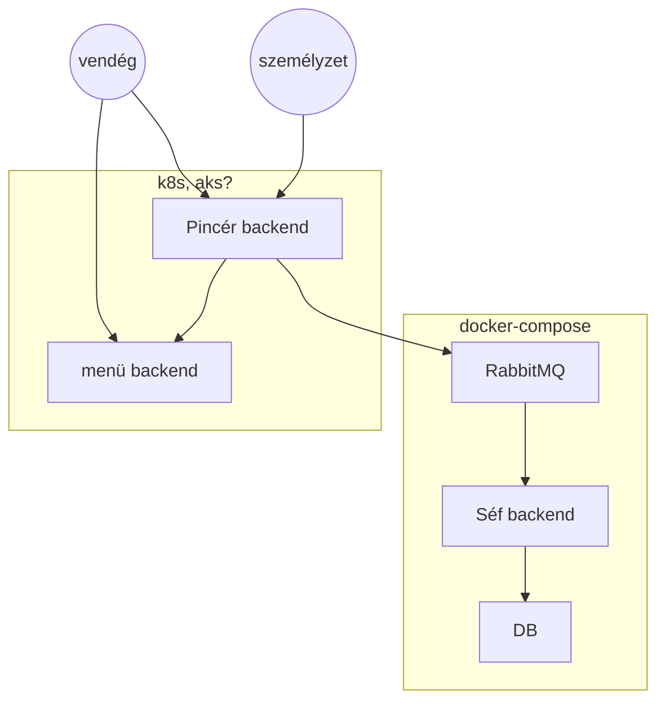

### Skála nagyházifeladat
Egy éttermi ügyviteli rendszert szeretnék felépíteni. Amit próbáltam olyan módon elképzelni, hogy tükrözhesse az elvárásokat.
  -  vendég
     -  az emberek akik rendelést adnak le, feltételezzük, hogy előre fizetnek
  -  személyzet
     -  emberek akik adminisztráláják az éttermet
  -  menü backend
     -  itt lehet megtekinteni az ételeket GETtel,
  -  Pincér backend
     - a felhasználók tudnak POST-ot küldeni, hogy leadjanak egy rendelést
       - ekkor a rendelés bekerül egy rabbitMQ-s  message queueba
     - szerkeszthetőek az aktuálisan elérhető ételek, POST v. PATCH segítségével, a menüben
  -  Konyha backend
     -  A MQ-ból periodikusan tud kiszedni 1 rendelést minden rendelésen 10 másodpercet dolgozik.
     -  Az éppen konyhán elvégzett rendelés kikerül a vendéghez. Ezért a kész rendeléseket beírja a DB-be is dátum, étel, ár formában

A kör alakú node-ok csak a felhasználókat jelzik.

#### ~~Tervezett~~ szándékozott pontok

- LANG2;5
  - Több implementációs nyelv használata. A backend szolgáltatások legalább két különböző programozási nyelven készültek. (A frontend ebbe nem számít bele!)
- ASYNCCOMM;5
  - Aszinkron, üzenetsor alapú kommunikáció mikroszolgáltatások között saját telepítésű (pl. RabbitMQ konténer) üzenetsor, üzenetkezelő (messaging) szolgáltatással: 5 pont
    - Integrációs esemény eventually consistency adatkezeléshez
- HELM;10
  - A szolgáltatás kubernetes-en belül futó része Helm chart-on keresztül telepíthető. Szükséges demonstrálni a rendszer frissítését a chart segítségével
- K8SCMAP;5
  - Kubernetes ConfigMap objektum használata valamely konfigurációs beállítás tárolására
- K8SSECRET;3
  - Kubernetes Secret objektum használata titok tárolására
- CICD;10
  - CI/CD folyamat implementálása valamely elterjedt DevOps eszközre építve (GitHub Actions, Azure DevOps). Git push-ra a backend új verziója elkészül és kitelepül: 10 pont
    - egy platformra telepít
- OPACR;5 
  - Konténerek vagy helm chart(ok) letöltése on-premise klaszterbe saját Azure Container Registry-ből: 5 pont
    - anonim eléréssel
- OPSTR;5
  - Tartós tár, pl. lokális mappa csatolása klaszterbe
- BASE;24
  - a rendszer kifelé egy jól körülhatárolható funkcióhalmazzal rendelkező (pl. könyvtári nyilvántartás) egységes szolgáltatást (backend) valósít meg,
de belül több részre (mikroszolgáltatás) van darabolva. A mikroszolgáltatások külön-külön API-val rendelkeznek, mely hálózaton keresztül (pl. más mikroszolgáltatásokból) hívható.
  - a szolgáltatás minden része valamely orkesztrációs vagy serverless platformon fut. Választható platformok:
    - saját gépen futó (on-premise) Kubernetes (K8S)
    - saját gépen futó (on-premise) docker compose
    - Azure Kubernetes Services (AKS)
    - Azure Functions (AZF)
    - Azure Container Apps (ACA)

- ALLHF;6

Sum: 78